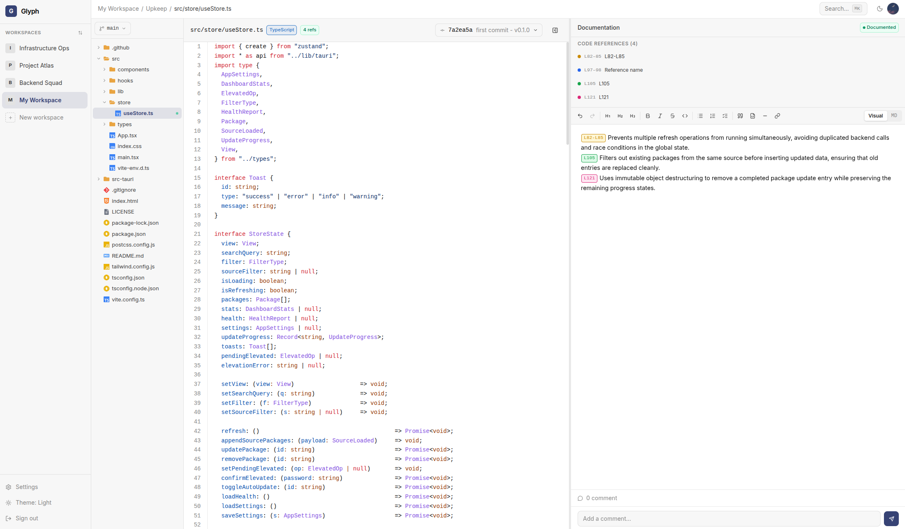
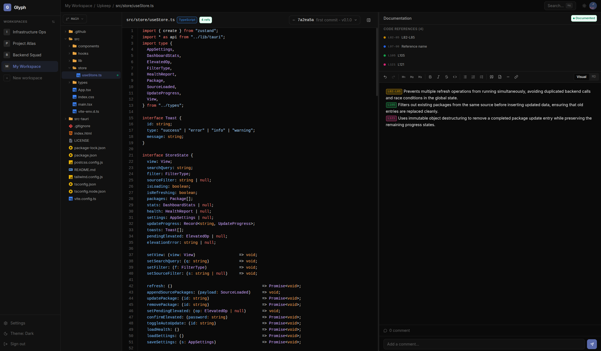

<p align="center">
  
</p>

<h1 align="center">Glyph</h1>

<p align="center">
  <b>Versioned documentation for your Git projects.</b>
</p>

<p align="center">
  Annotate code, attach docs to specific commits, collaborate with your team - all from your browser.
</p>

<p align="center">
  <a href="https://glyph-docs.netlify.app">Documentation</a> ·
  <a href="https://hub.docker.com/u/rseize">Docker Hub</a> ·
  <a href="https://github.com/r-seize/Glyph/issues">Issues</a>
</p>

<table width="100%">
  <tr>
    <td width="50%"></td>
    <td width="50%"></td>
  </tr>
</table>

## The problem Glyph solves

Most teams document their code in three places:

- **Inside the code** - comments and docstrings, lost when files are moved or rewritten
- **In a wiki** - separate from the code, gets stale within weeks
- **In tribal knowledge** - leaves the team with the engineer

Glyph fixes this by anchoring documentation directly to your Git history. Every doc is tied to a specific file at a specific commit - it travels with your code, not away from it.

## What is Glyph?

Glyph is an open-source, self-hosted platform that lets you write **versioned documentation** for any Git repository. Unlike a wiki, every documentation entry is anchored to a specific file at a specific commit - your docs evolve with your code and never go stale.

Import projects from **GitHub, GitLab, any Git URL, or upload local folders**. Annotate exact line ranges with labeled code references. Search across files and documentation. Invite teammates with role-based access.

## Quick start

The fastest way to run Glyph is with Docker. Two commands and you're up:

```bash
curl -O https://raw.githubusercontent.com/r-seize/Glyph/main/docker-compose.prod.yml
curl -O https://raw.githubusercontent.com/r-seize/Glyph/main/.env.example
cp .env.example .env
# Edit .env and set your passwords (see the docs)
docker compose -f docker-compose.prod.yml up -d
```

Open **http://localhost:3000** and create your first account.

For complete installation, configuration, and deployment instructions, see the **[documentation](https://glyph-docs.netlify.app)**.

## Features

- **Versioned docs** - attached to `(file, commit)` pairs, history-aware
- **Multi-source import** - GitHub, GitLab, Git URL, or local folder upload
- **Code references** - annotate line ranges and embed them inline with `{{label}}`
- **Workspaces & roles** - admin, developer, viewer
- **Full-text search** - across files, projects, and documentation
- **Email invitations** - Resend, SendGrid, Mailgun, or SMTP
- **Light / dark theme** - with persistence
- **Self-hosted** - your data stays on your infrastructure

## Documentation

Full documentation is available at **[glyph-docs.netlify.app](https://glyph-docs.netlify.app)**.

Topics covered:

- [Getting Started](https://glyph-docs.netlify.app/docs/getting-started/introduction/)
- [Core Concepts](https://glyph-docs.netlify.app/docs/concepts/workspaces/)
- [Features](https://glyph-docs.netlify.app/docs/features/authentication/)
- [Configuration](https://glyph-docs.netlify.app/docs/configuration/environment-variables/)
- [Deployment](https://glyph-docs.netlify.app/docs/deployment/docker/)
- [Troubleshooting & FAQ](https://glyph-docs.netlify.app/docs/reference/troubleshooting/)

## Container images

Pre-built multi-architecture images (`linux/amd64`, `linux/arm64`) are available on Docker Hub:

- [`rseize/glyph-backend`](https://hub.docker.com/r/rseize/glyph-backend)
- [`rseize/glyph-frontend`](https://hub.docker.com/r/rseize/glyph-frontend)

## Contributing

Contributions are welcome - bug reports, feature requests, and pull requests.

1. Fork the repository
2. Create a feature branch
3. Open a pull request against `main`

Please follow the existing code style and add tests where applicable.

## License

Glyph is released under the **GNU General Public License v3.0**. See [LICENSE](LICENSE) for the full text.

